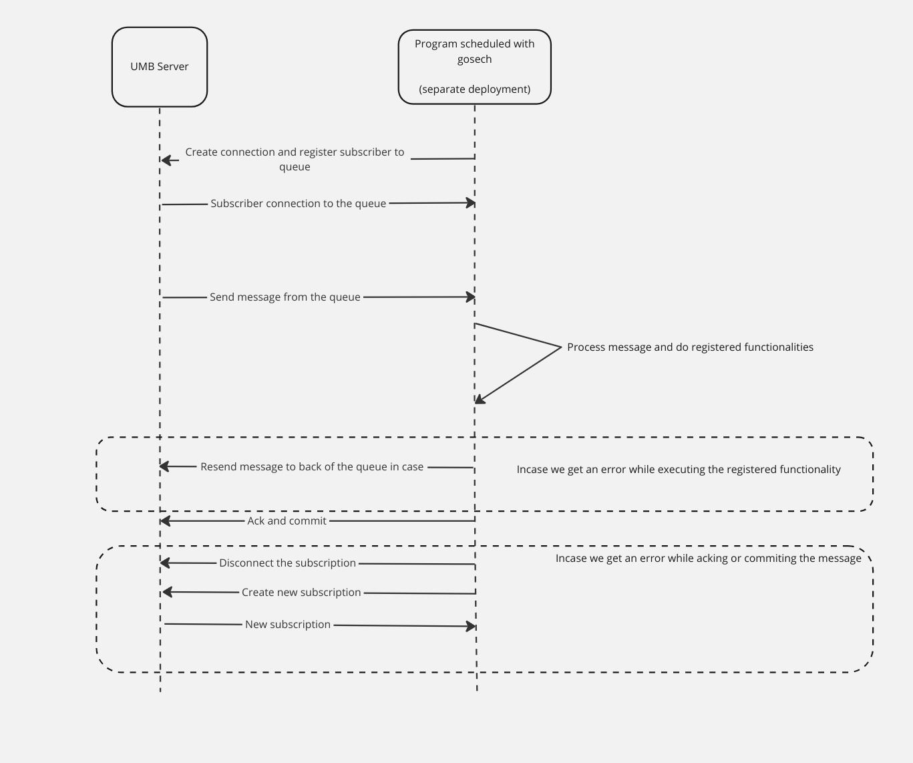

# Gosech

This is a repo with which you can listen to streaming data on a stomp server. With GoSech you need to register the function once and it will start executing the registered function on the each message sent on the queue. There is also support where you can register multiple functions with a unique jobID per instance it is running. Gosech will match the job ID of the function and with the job ID of the message passed if it is able to find a function related to it, the corresponding logic would be executed else the message would be discarded.

In case the registered function returns an error in that scenario, Gosech would send the message back to the end of the queue for reprocessing and will be retried again. If user wants to restrict the number of times a message is being processed, they can specify a value in NewService method other than 0, if it is 0 Gosech would try to send message. 

NOTE - We need to specify job ID in message headers, with the key `job-id`.

### Install
```bash
go get github.com/shubhvish4495/gosech
```

### Design


# Creating a new Gosceh service
```
serv, err := gosech.NewService("localhost:61613", nil, "test.task.queue", 3)
if err != nil {
    log.Println(err)
    return
}
```

### Registering functions with job ID
```
serv.RegisterFuncWithJobID("jobID1", func(m []byte) error {
    fmt.Println(string(m))
    if rand.Int()%2 == 0 {
        return errors.New("new random error passed")
    }
    return nil
})

serv.RegisterFuncWithJobID("jobID2", func(m []byte) error {
    fmt.Println("from jobID2")
    fmt.Println(string(m))
    return nil
})
```

### Start processing the message
```
f err := serv.StartMultiFuncProcessing(); err != nil {
    log.Println(err)
    return
}
```
Call to StartMultiFuncProcessing or StartProcessing is blocking in nature. In future if required support for async processing will also be added.